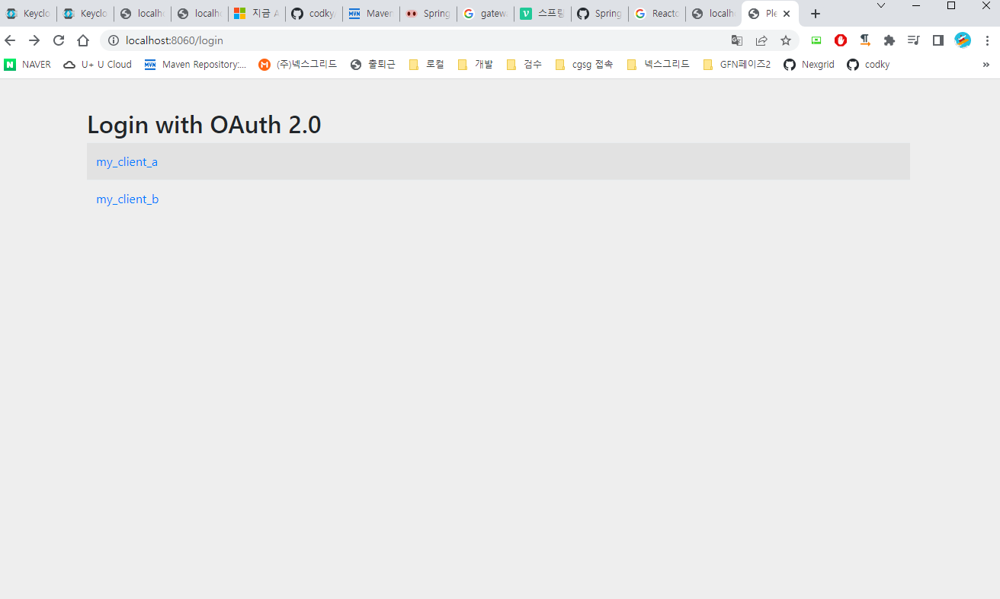
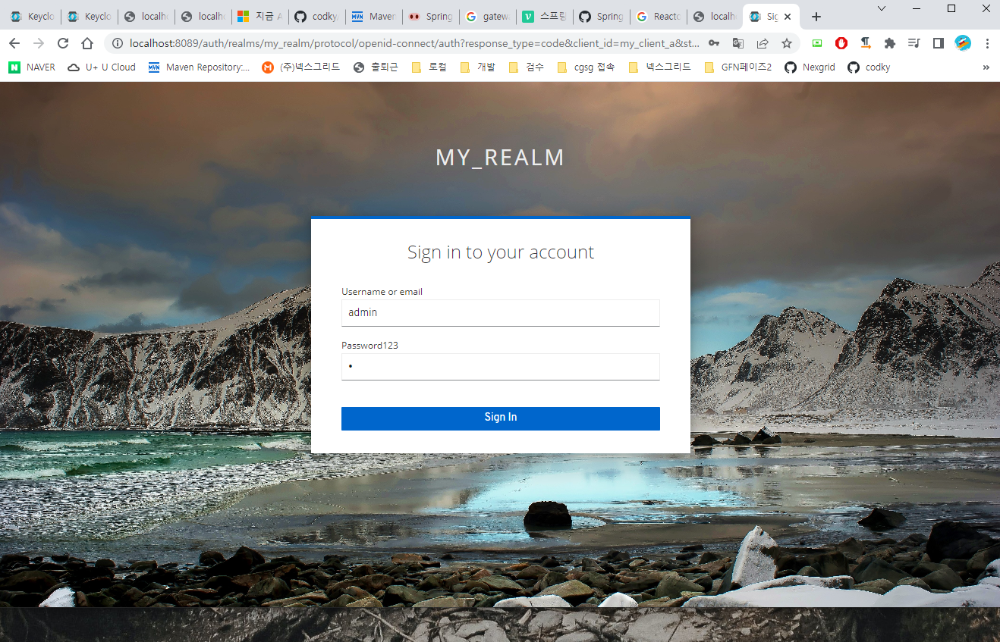
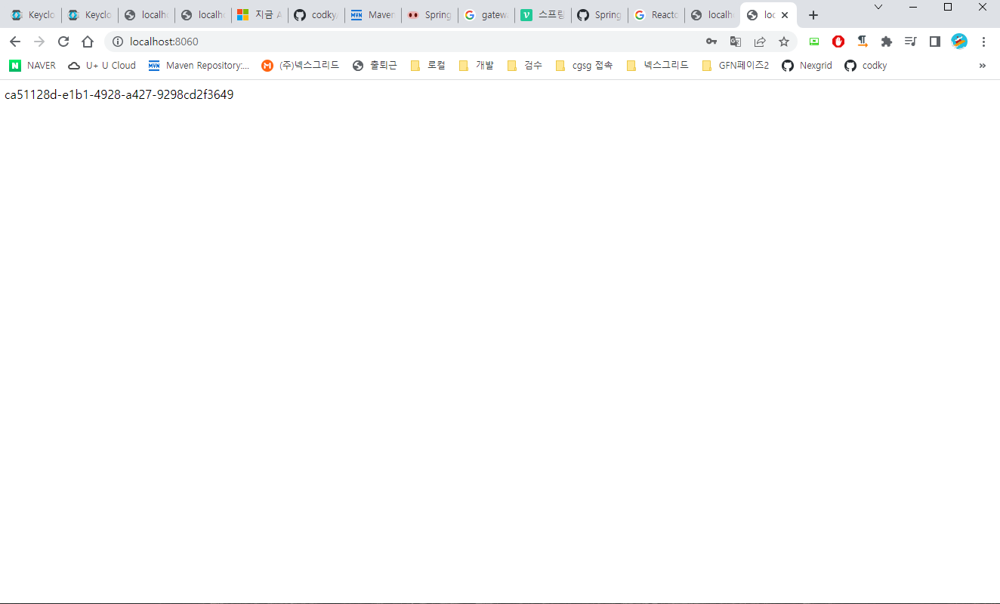
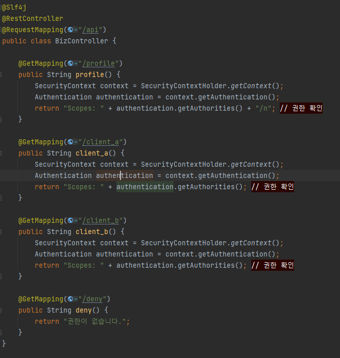
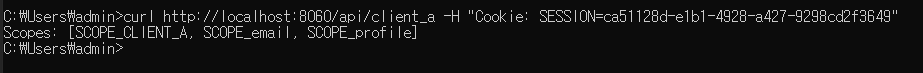
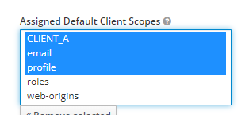
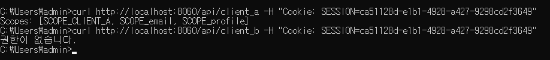
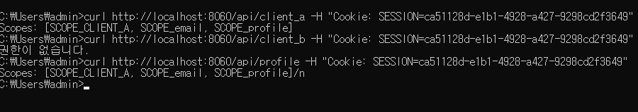

# http://localhost:8060/login

# keycloak(authorization server)에서 로그인페이지 제공

# authorization_code = session id

# API

# my_client_a 의 권한

# my_client_b 호출시 권한 없음

# localhost:8060/api/profile 호출

